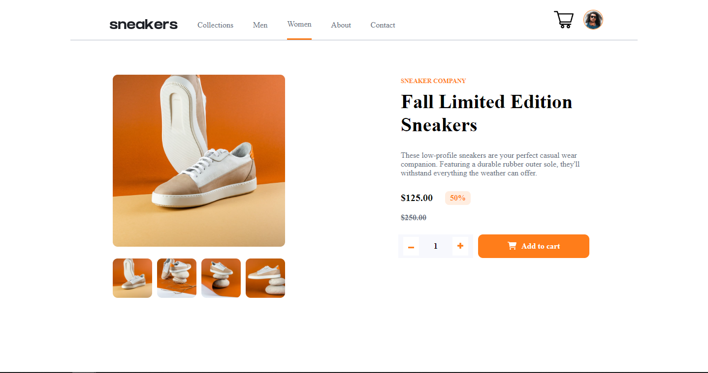

# E-Commerce-React

> Website for selling sneakers (e-commerce).

As mentioned, the website lists unique sneakers for sale. We have one functional nav section which is:

Women: Page where you can view unique women's sneakers along with information about them add them to your cart.

## Built With

- HTML5
- CSS3
- JavaScript
- React.js
- react-router-dom
- styled-components
- tailwind-css
- react-icons

## Live Demo

[Live Demo Link](https://e-commerce-shop-sneaker.netlify.app/women)

## Getting Started

**This is an example of how you may give instructions on setting up your project locally.**
**Modify this file to match your project, remove sections that don't apply. For example: delete the testing section if the currect project doesn't require testing.**

- To get a local copy up and running follow these simple example steps.

### Prerequisites

- You need npm to be installed on your local machine. For details please use the following site :https://docs.npmjs.com/downloading-and-installing-node-js-and-npm

### Setup

- Next you need to clone the repository on your local machine with the following command line:
  git clone https://github.com/vTanchev/Product-page

### Install

- To install the project you need to enter the directory you've cloned. Open a terminal and follow these next steps:
- npm install (to install all the necessary modules and dependencies);

### Usage

- To run this project localy simply run the following line:

npm start;

- And the project should be deployed on your machine and you can access it on a browser by default on the URL: localhost:3000

## Authors

�� **Vasko Tanchev**

- GitHub: [@vTanchev](https://github.com/vTanchev)
- Twitter: [@xin0w](https://twitter.com/xin0w)
- LinkedIn: [vTanchev](https://www.linkedin.com/in/vasko-tanchev)

�� **Nadica Ristic**

- GitHub: [@nadicaristic](https://github.com/nadicaristic)
- Twitter: [@nadicaristic](https://twitter.com/nadicaristic)
- LinkedIn: [nadica-ristic](https://www.linkedin.com/in/nadica-ristic/)

## �� Contributing

Contributions, issues, and feature requests are welcome!

Feel free to check the [issues page](issues/).

## Show your support

Give a ⭐️ if you like this project!

## Acknowledgments

- https://e-commerce-shop-sneaker.netlify.app/women

## �� License

This project is [MIT](lic.url) licensed.
